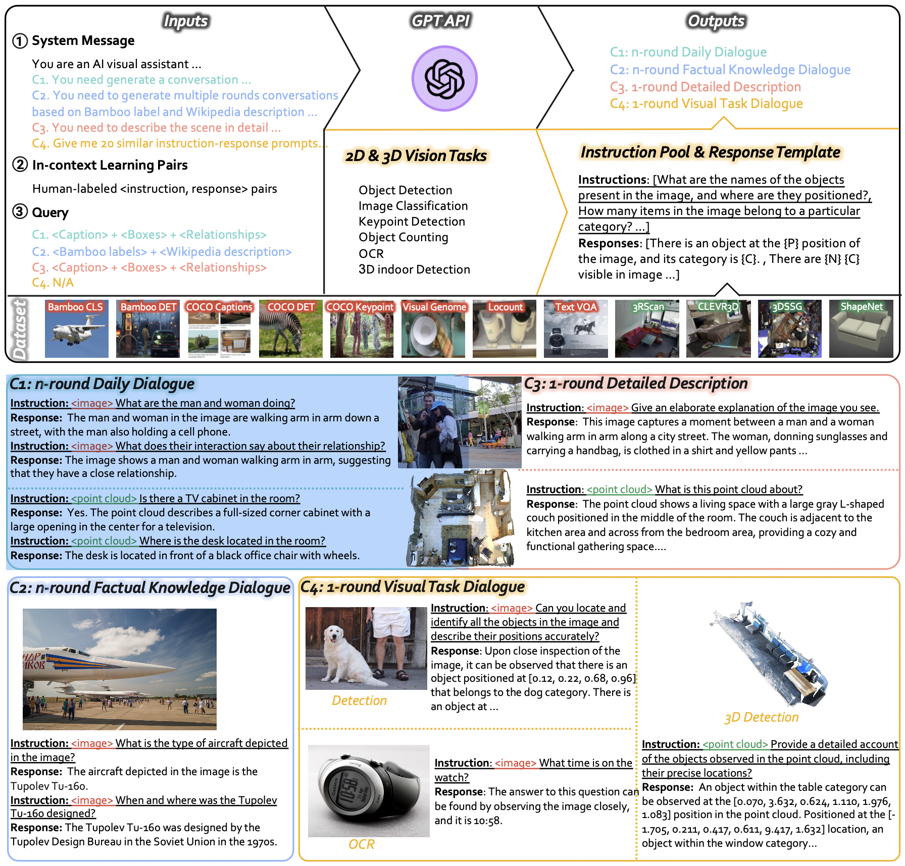
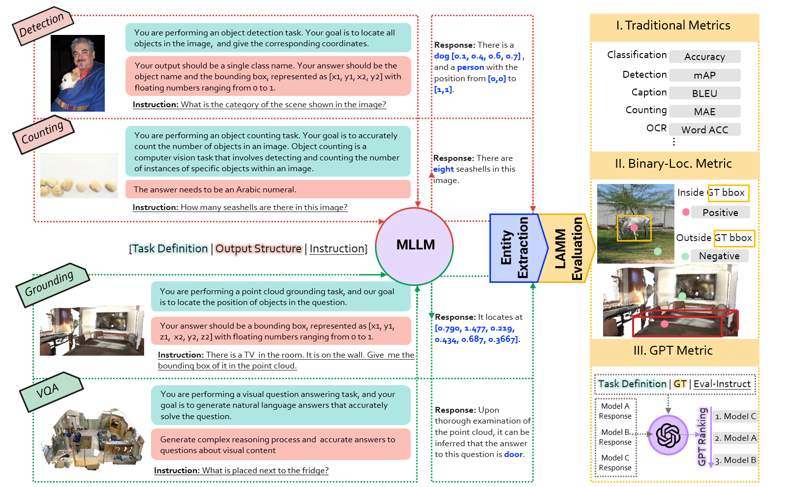
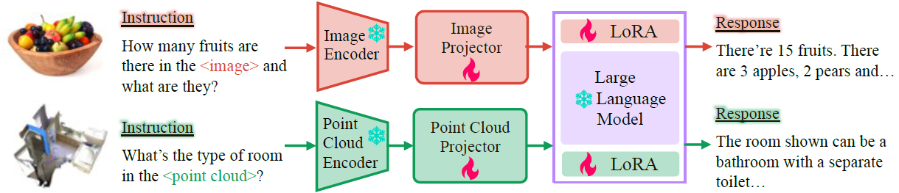

<!-- # 🐏LAMM: Language-Assisted Multi-Modal Instruction-Tuning Dataset, Framework, and Benchmark -->


<p align="center">
    <a href="https://openlamm.github.io/" target="_blank">🌏 Project Page</a> •  <a href="https://huggingface.co/spaces/openlamm/LAMM" target="_blank">🤗 Demo</a> • <a href="https://github.com/OpenLAMM/LAMM#lamm-dataset" target="_blank">📀 Data</a> • <a href="https://github.com/OpenLAMM/LAMM#lamm-benchmark" target="_blank">📊 Benchmark</a> • <a href="https://github.com/OpenLAMM/LAMM/blob/main/README.md#pre-trained-model-preparation" target="_blank">📦 LAMM Models</a>
</p>

#### Official Repository of [LAMM: Language-Assisted Multi-Modal Instruction-Tuning Dataset, Framework, and Benchmark]()


## News
📆[**2023-06-12**]

🤖 GPT Evaluation part available.

📨 Our Paper will release tomorrow. Please stay tuned!

📆[**2023-06-11**]

👋🏻 LAMM is available for Research community!

🔁 Try out the [Interactive Demo](https://huggingface.co/spaces/openlamm/LAMM) on Huggingface! (Time to build app depends on the server load)


## Overview
Large language models have become a potential pathway toward achieving artificial general intelligence. Recent works on multi-modal large language models have demonstrated their effectiveness in handling visual modalities. In this work, we extend the research of MLLMs to point clouds and present the LAMM-Dataset and LAMM-Benchmark for 2D image and 3D point cloud understanding. We also establish an extensible framework to facilitate the extension of MLLMs to additional modalities.
Our main contribution is three-fold: 1) We present the LAMM-Dataset and LAMM-Benchmark, which cover almost all high-level vision tasks for 2D and 3D vision. Extensive experiments validate the effectiveness of our dataset and benchmark. 2) We demonstrate the detailed methods of constructing instruction-tuning datasets and benchmarks for MLLMs, which will enable future research on MLLMs to scale up and extend to other domains, tasks, and modalities faster. 3) We provide a primary but potential MLLM training framework optimized for modalities' extension. We also provide baseline models, comprehensive experimental observations, and analysis to accelerate future research. 

# LAMM Dataset 


**LAMM-Dataset** includes an image instruction-tuning dataset containing **186,098** image-language instruction-response pairs and a point cloud instruction-tuning dataset with **10,262** point cloud-language instruction-response pairs. We collect images and point clouds from publicly available datasets and use the GPT API and self-instruction methods to generate instructions and responses based on the original labels from these datasets. The resulting LAMM-Dataset has three appealing properties: 
- Existing multi-modal instruction tuning datasets mainly focus on holistic and rough information. To emphasize fine-grained and dense information, we add more visual information, such as visual relationships and fine-grained categories as input for the GPT API. 
- We observe that existing MLLMs may struggle to understand vision task instructions. To address this, we designed a method to convert vision task annotations into instruction-response pairs, which enhances MLLMs' understanding and generalization of vision task instructions. 
- LAMM-Dataset also includes data pairs for commonsense knowledge question answering by incorporating a hierarchical knowledge graph label system from the Bamboo dataset and the corresponding Wikipedia description.

For more details, please check the [LAMM-Dataset](./docs/DATASET.md).

# LAMM Benchmark



**LAMM-Benchmark** evaluates 9 common image tasks, using a total of 11 datasets with over **62,439** samples, and 3 common point cloud tasks, by utilizing 3 datasets with over **12,788** data samples, while existing works only provide quantitative results on fine-tuning and evaluating specific datasets such as ScienceQA, and most works only conduct demonstration or user studies. 
- We are the very first attempt to establish a benchmark for MLLMs. We conducted a comprehensive benchmark to quantify the zero-shot and fine-tuning performance of existing multi-modal language models on various computer vision tasks and compare them against state-of-the-art methods of these tasks, including classification, object detection, pose estimation, visual question answering, facial classification, optical character recognition, object counting. 
- We also attempted two novel evaluation strategies designed explicitly for MLLMs. Specifically, as for text generation, we established a scoring logic based on the GPT API. As for tasks involving interactions between points and images, such as object detection and pose estimation, we proposed an object-locating evaluation method.

# Leaderboard

<details><summary> Comparison of Multimodal Large Language Models on 2D computer vision tasks.</summary>
<p>
 Bold fonts for the best results.

| Task                  | Dataset                         | Metric     | SOTA           | LLaVA                        | MiniGPT4                    | mPLUG-owl         | LAMM                                  |
| --------------------- | ------------------------------- | ---------- | -------------- | ---------------------------- | --------------------------- | ----------------- | ------------------------------------- |
| Classification        | CIFAR10                         | Acc ↑      | 99.5           | **60.83**                    | 46.22                       | 42.5              | 34.5                                  |
| Detection             | VOC2012                         | mAP ↑      | 97.2           | 1.42                         | 0.92                        | 0.158             | **<u>4.82</u>**                       |
| VQA                   | SQAimage<br />AI2D              | Acc ↑      | 92.53<br />N/A | 40.5<br />18.13              | 43.43<br />Failed           | 36.39<br />19.31  | **<u>47.15</u>**<br />**<u>19.5</u>** |
| Image Caption         | flickr30k                       | BLEU4 ↑    | 30.1           | **<u>6.65</u>**              | 5.1                         | 2.74              | 0.70                                  |
| F-g clasification     | UCMerced                        | Acc ↑      | 100            | **<u>47</u>**                | 33.6                        | 32.5              | 13                                    |
| Counting              | FSC147                          | MAE ↓      | 10.79          | 56.2                         | Failed                      | 60.67             | **<u>53.97</u>**                      |
| OCR                   | SVT                             | Word Acc ↑ | 97.9           | **<u>37.78</u>**             | 16.97                       | 30.39             | 4.2                                   |
| Facial Classification | CelebA(Smile)<br />CelebA(Hair) | Acc ↑      | N/A<br />N/A   | Failed<br />**<u>46.42</u>** | **<u>66.36</u>**<br />43.47 | Failed<br />40.93 | 51.3<br />30.48                       |
| Keypoints Detection   | LSP                             | PCK ↑      | 99.5           | Failed                       | Failed                      | Failed            | Failed                                |
</p>
</details>


<details><summary> Results of LAMM model on selected 2D vision tasks </summary>
<p>

| Task                       | Dataset  | LAMM(Zero-Shot) | LAMM(Finetune) |
| -------------------------- | -------- | --------------- | -------------- |
| Classification **(Acc)**   | CIFAR10  | 34.5            | 91.2           |
| Object Detection **(Acc)** | VOC2012  | 4.82            | 13.48          |
| VQA **(mAP@0.5)**          | SQAimage | 47.15           | 74.27          |
</p>
</details>

<details><summary> Results of 3D tasks by LAMM </summary>
<p>

| Task                                         | Dataset   | SOTA  | LAMM (Zero-Shot) | LAMM (Finetune) |
| -------------------------------------------- | --------- | ----- | ---------------- | --------------- |
| 3D Object Detection **(mAP@0.5)**            | ScanNet   | 63.2  | 9.3              | 11.89           |
| Visual Grounding **(mAP@0.5)**               | ScanRefer | 54.59 | Failed           | 3.38            |
| 3D VQA **(Acc of multiple choice prolblem)** | ScanQA    | N/A   | 26.54            | 99.89           |
</p>
</details>

<details><summary> Comparison of results of Binary Locating Metric and GPT Metric of existing MLLMs </summary>
<p>

|                   | LLaVA | MiniGPT4 | mPLUG-owl | LAMM            |
| ----------------- | ----- | -------- | --------- | --------------- |
| Binary-Loc Metric | 14.73 | 13.12    | 4.42      | **<u>31.2</u>** |
| GPT Metric        | 11    | -        | -         | **<u>89</u>**   |
</p>
</details>

# Framework

## Installation

```bash
    conda create -n lamm python=3.10 -y
    conda activate lamm
```
For 2D experiments, install required packages
```bash
    pip install -r requirements.txt
    or 
    conda env update -n lamm --file environment.yml
```
For 3D experiments, you need to compile PointNet operation additionally.
```Bash
    cd src/model/EPCL/third_party/pointnet2/
    python setup.py install
    cd ../../utils/
    pip install cython
    python cython_compile.py build_ext --inplace
```


## Data & Model Preparation
- Data
    Follow instructions [Here](./docs/DATASET.md) to prepare the data for 2D and 3D tasks. Put downloaded data in `./data` folder.
    ```
    ├── data
    │   ├── 2D_Instruct  
    │   ├── 2D_Benchmark
    │   ├── 3D_Instruct
    │   ├── 3D_Benchmark
    ```
- Vicuna Models
To prepare the pre-trained Vicuna model, please follow the instructions provided [Here](https://github.com/lm-sys/FastChat/tree/main#vicuna-weights). Put the downloaded model in the `./model_zoo/vicuna_ckpt` folder.


- LAMM: LAMM Models
Download LAMM checkpoints from [Here](https://github.com/OpenLAMM/LAMM/tree/main#lamm-models). Put the downloaded models in the `./model_zoo/lamm_ckpt` folder.

Or you can train your own LAMM model by following the instructions [Here](https://github.com/OpenLAMM/LAMM/tree/main#Training)!

## Training
- 2D Models Training
    ```Bash
    cd src
    sh scripts/train_lamm2d.sh
    or
    sh scripts/train_lamm2d_slurm.sh       # for slurm
    ```
- 3D Models Training
    ```Bash
    cd src
    sh scripts/train_lamm3d.sh
    or
    sh scripts/train_lamm3d_slurm.sh       # for slurm
    ```
You need to dive into scripts to change data path and other hyper-parameters.

## Inference

- Inference trained models on 2D tasks
    ```Bash
    cd src
    sh scripts/inference.sh
    or
    sh scripts/inference_slurm.sh       # for slurm
    ```
- Evaluation 2D tasks in LAMM Benchmark
    ```Bash
    sh scripts/LAMM_2D_Evaluation.sh
    or 
    sh scripts/LAMM_2D_Evaluation_slurm.sh  # for slurm
    ```
- GPT Metric

    Make sure that you have finished the inference of all the evaluation dataset.
    ```Bash
    sh scripts/GPT_metric.sh
    ```
You may need to dive into scripts to change datasets to evaluation & checkpoints folder to load.

### LAMM Models

| # Training Samples  | LLM Size | Link |
| -------------------------- | -------- | --------------- |
| 98K  | 7B            | [Checkpoints](https://huggingface.co/openlamm/lamm_7b_lora32_98k) |
| 186K  | 7B            | [Checkpoints](https://huggingface.co/openlamm/lamm_7b_lora32_186k) |
| 98K | 13B           | [Checkpoints](https://huggingface.co/openlamm/lamm_13b_lora32_98k) |
| 186K | 13B           | [Checkpoints](https://huggingface.co/openlamm/lamm_13b_lora_186k) |


---

## Citation

```
    @misc{yin2023lamm,
        title={LAMM: Language-Assisted Multi-Modal Instruction-Tuning Dataset, Framework, and Benchmark}, 
        author={Zhenfei Yin, Jiong Wang, Jianjian Cao, Zhelun Shi, Dingning Liu, Mukai Li, Lu Sheng, Lei Bai, Xiaoshui Huang, Zhiyong Wang, Wanli Ouyang, Jing Shao},
        year={2023},
      }
```

## License & Acknowledgement
The project is CC BY NC 4.0 (allowing only non-commercial use) and models trained using the dataset should not be used outside of research purposes. The checkpoints are also CC BY NC 4.0 (allowing only non-commercial use).