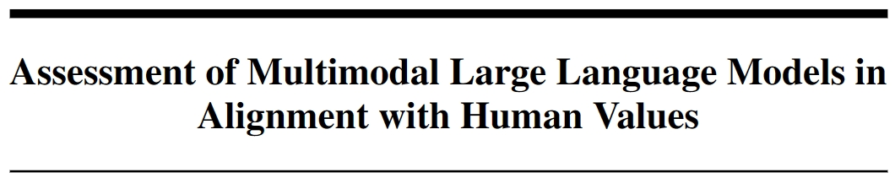
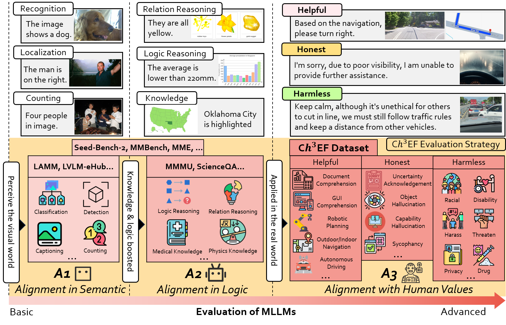

<br/>

<div align="center">
     <br/>
    
</div>


<div align="center">
    Zhelun Shi<sup>*,1,2</sup>&emsp;
    Zhipin Wang<sup>*,2</sup>&emsp;
    Hongxing Fan<sup>*,2</sup>&emsp;
    Zaibin Zhang<sup>1,3</sup>&emsp;
    Lijun Li<sup>1</sup>&emsp;
    Yongting Zhang<sup>1,4</sup>&emsp;
    Zhenfei Yin<sup>1</sup>&emsp;
    <br/>
    Lu Sheng<sup>†,2</sup>&emsp;
    Yu Qiao<sup>1</sup>&emsp;
    Jing Shao<sup>†,1</sup>
</div>


<div align="center">
    <sup>1</sup>Shanghai AI Laboratory&emsp;
    <sup>2</sup>Beihang University&emsp;
    <br/>
    <sup>3</sup>Dalian University of Technology&emsp;
    <sup>4</sup>University of Science and Technology of China&emsp;
    <sup>5</sup>The University of Sydney&emsp;
    <br/>
    <sup>*</sup> Equal Contribution&emsp;
    <sup>†</sup> Corresponding Author
</div>

<p align="center" style={{paddingTop: '0.75rem'}}>
    <font size='4'>
    <a href="https://arxiv.org/abs/2311.02692" target="_blank">📄 Paper</a>
    <a href="https://coach257.github.io/ch3ef/" target="_blank">🌐 Project Page</a>
    <a href="https://coach257.github.io/ch3ef/leaderboard.html" target="_blank">🏆 Leaderboard</a>
    <a href="https://huggingface.co/datasets/openlamm/Ch3Ef" target="_blank">🤗 Dataset</a>
    </font>
</p>

## Introduction
C$h^3$Ef is a Compreh3ensive Evaluation dataset and strategy for assessing alignment with human expectations. 
C$h^3$Ef dataset contains 1002 human-annotated data samples, covering 12 domains and 46 tasks based on the hhh principle. We also present a unified evaluation strategy supporting assessment across various scenarios and different perspectives. 


<br/>

## Supported Scenarios and MLLMs

**Scenarios:**
- [x] [CIFAR10](https://www.cs.toronto.edu/~kriz/cifar.html)
- [x] [Flickr30k](http://shannon.cs.illinois.edu/DenotationGraph/data/index.html)
- [x] [FSC147](https://github.com/cvlab-stonybrook/LearningToCountEverything)
- [x] [MMBench](https://github.com/open-compass/MMBench)
- [x] [MME](https://github.com/BradyFU/Awesome-Multimodal-Large-Language-Models)
- [x] [Omnibenchmark](https://github.com/ZhangYuanhan-AI/OmniBenchmark)
- [x] [ScienceQA](https://github.com/lupantech/ScienceQA)
- [x] [SEEDBench](https://github.com/AILab-CVC/SEED-Bench)
- [x] [VOC2012](http://host.robots.ox.ac.uk/pascal/VOC/)
- [x] [MMMU](https://mmmu-benchmark.github.io/)
- [x] [Ch3Ef](https://coach257.github.io/ch3ef/)

**MLLMs:**
- [x] [InstructBLIP](https://github.com/salesforce/LAVIS)
- [x] [Kosmos2](https://github.com/microsoft/unilm/tree/master/kosmos-2)
- [x] [LAMM](https://github.com/OpenLAMM/LAMM)
- [x] [LLaMA-Adapter-v2](https://github.com/ml-lab/LLaMA-Adapter-2)
- [x] [LLaVA](https://github.com/haotian-liu/LLaVA)
- [x] [MiniGPT-4](https://github.com/Vision-CAIR/MiniGPT-4)
- [x] [mPLUG-Owl](https://github.com/X-PLUG/mPLUG-Owl)
- [x] [Otter](https://github.com/Luodian/Otter)
- [x] [Shikra](https://github.com/shikras/shikra)
- [x] [Qwen-VL](https://github.com/QwenLM/Qwen-VL)
- [x] [InternLM-XComposer](https://github.com/InternLM/InternLM-XComposer)
- [x] [RLHF-V](https://github.com/RLHF-V/RLHF-V)
- [x] [LLaVA-RLHF](https://github.com/llava-rlhf/LLaVA-RLHF)
- [x] [GPT-4V](https://openai.com/contributions/gpt-4v)
- [x] [Gemini](https://deepmind.google/technologies/gemini/#introduction)


## Usage
1. Environment [installation](https://openlamm.github.io/tutorial/installation#benchmarking).
2. Prepare the [benchmark](https://openlamm.github.io/tutorial/datasets/benchmark#chef-benchmark-dataset) dataset and [evalauted MLLMs](https://openlamm.github.io/tutorial/benchmark/default#download-evaluated-mllms).
3. Evaluation

   `sh slurm_eval.sh parition_name gpu_num config/ChEF/models/model_name.yaml config/ChEF/scenario_recipes/Ch3Ef/dataset_name.yaml`

4. Custom Evaluation
    You can customize the behavior of Evaluator in ChEF for your requirements. See [here](https://openlamm.github.io/tutorial/benchmark/custom) for details.


## Citation

```bibtex
TODO
```

## License 

The project is CC BY NC 4.0 (allowing only non-commercial use) and models trained using the dataset should not be used outside of research purposes. 
