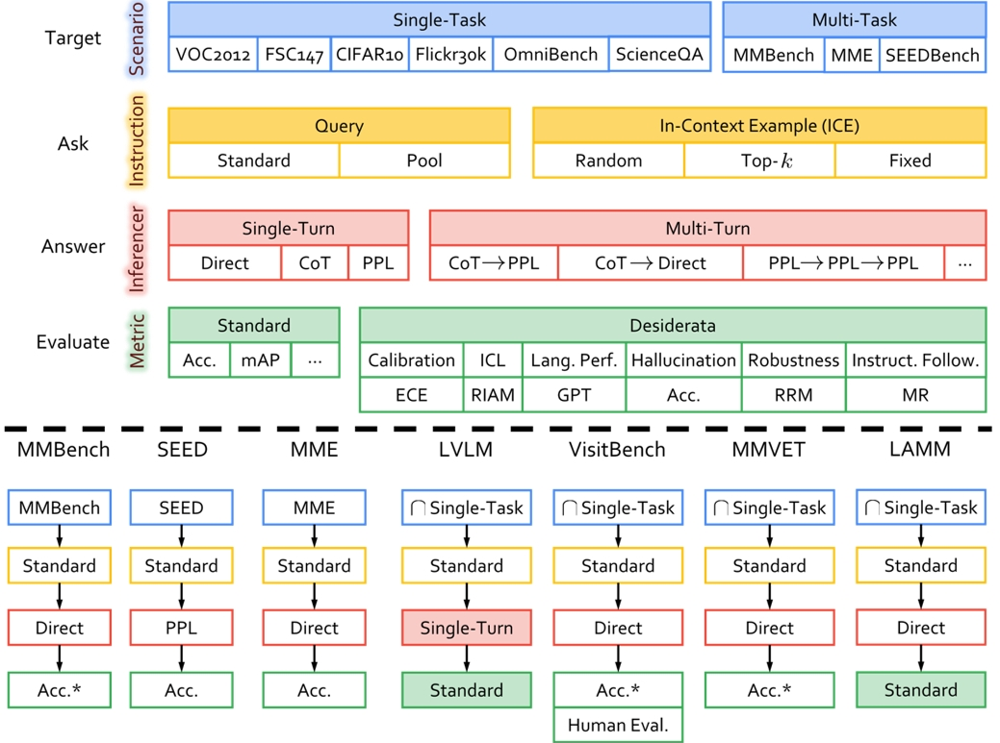

<br/>

<div align="center">
     <br/>
    
</div>


<div align="center">
    Zhelun Shi<sup>*,1,2</sup>&emsp;
    Zhipin Wang<sup>*,1</sup>&emsp;
    Hongxing Fan<sup>*,1</sup>&emsp;
    Zhenfei Yin<sup>2</sup>&emsp;
    <br/>
    Lu Sheng<sup>†,1</sup>&emsp;
    Yu Qiao<sup>2</sup>&emsp;
    Jing Shao<sup>†,2</sup>
</div>


<div align="center">
    <sup>1</sup>Beihang University&emsp;
    <sup>2</sup>Shanghai AI Laboratory
    <br/>
    <sup>*</sup> Equal Contribution&emsp;
    <sup>†</sup> Corresponding Author
</div>

<p align="center" style={{paddingTop: '0.75rem'}}>
    <font size='4'>
    <a href="https://arxiv.org/abs/2311.02692" target="_blank">📄 Paper</a>
    </font>
</p>

## Introduction
ChEF is a Comprehensive Evaluation Framework for reliable and indicative assessment of MLLMs, which is highly scalable and can be flexibly modified to adapt to the evaluation of any new model or task.


<br/>

ChEF decouples the evaluation pipeline into four components: 

- **Scenario**: A set of datasets concerning representative multimodal tasks that are suitable for MLLMs.
- **Instruction**: The module of posing questions and setting instruction examples to the MLLMs. 
- **Inferencer**: Strategies for MLLMs to answer questions.
- **Metric**: Score functions designed to evaluate the performance of MLLMs. 

With a systematic selection of these four componets, ChEF facilitates
versatile evaluations in a standardized framework. Users can easily build new evaluations according to new **Recipes** (i.e. specific choices of the four components). ChEF also sets up several new evaluations to quantify the **Desiderata** (desired capabilities) that a competent MLLM model should possess.

## Supported Scenarios and MLLMs

**Scenarios:**
- [x] [CIFAR10](https://www.cs.toronto.edu/~kriz/cifar.html)
- [x] [Flickr30k](http://shannon.cs.illinois.edu/DenotationGraph/data/index.html)
- [x] [FSC147](https://github.com/cvlab-stonybrook/LearningToCountEverything)
- [x] [MMBench](https://github.com/open-compass/MMBench)
- [x] [MME](https://github.com/BradyFU/Awesome-Multimodal-Large-Language-Models)
- [x] [Omnibenchmark](https://github.com/ZhangYuanhan-AI/OmniBenchmark)
- [x] [ScienceQA](https://github.com/lupantech/ScienceQA)
- [x] [SEEDBench](https://github.com/AILab-CVC/SEED-Bench)
- [x] [VOC2012](http://host.robots.ox.ac.uk/pascal/VOC/)

**MLLMs:**
- [x] [InstructBLIP](https://github.com/salesforce/LAVIS)
- [x] [Kosmos2](https://github.com/microsoft/unilm/tree/master/kosmos-2)
- [x] [LAMM](https://github.com/OpenLAMM/LAMM)
- [x] [LLaMA-Adapter-v2](https://github.com/ml-lab/LLaMA-Adapter-2)
- [x] [LLaVA](https://github.com/haotian-liu/LLaVA)
- [x] [MiniGPT-4](https://github.com/Vision-CAIR/MiniGPT-4)
- [x] [mPLUG-Owl](https://github.com/X-PLUG/mPLUG-Owl)
- [x] [Otter](https://github.com/Luodian/Otter)
- [x] [Shikra](https://github.com/shikras/shikra)


## Usage

1. Environment [installation](https://openlamm.github.io/tutorial/installation#benchmarking).

2. Prepare the [benchmark](https://openlamm.github.io/tutorial/datasets/benchmark#chef-benchmark-dataset) dataset and [evalauted MLLMs](https://openlamm.github.io/tutorial/benchmark/default#download-evaluated-mllms).

3. Evaluation
    ChEF supports evaluation with several scenarios and recipes for MLLMs. See [here](https://openlamm.github.io/tutorial/benchmark/default#chef) for details.

4. Custom Evaluation
    You can customize the behavior of Evaluator in ChEF for your requirements. See [here](https://openlamm.github.io/tutorial/benchmark/custom) for details.
    
## Citation

```bibtex
@misc{shi2023chef,
      title={ChEF: A Comprehensive Evaluation Framework for Standardized Assessment of Multimodal Large Language Models}, 
      author={Zhelun Shi and Zhipin Wang and Hongxing Fan and Zhenfei Yin and Lu Sheng and Yu Qiao and Jing Shao},
      year={2023},
      eprint={2311.02692},
      archivePrefix={arXiv},
      primaryClass={cs.CV}
}
```

## License 

The project is CC BY NC 4.0 (allowing only non-commercial use) and models trained using the dataset should not be used outside of research purposes. 
