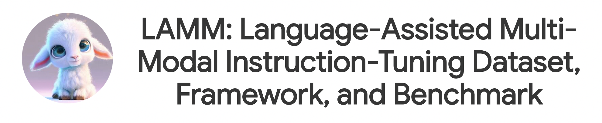

<!-- <div algn="center">
  <font size='6'>
    LAMM: Language-Assisted Multi-Modal Instruction-Tuning Dataset, Framework, and Benchmark
  </font>
</div> -->
<div align="center">
    Zhenfei Yin<sup>*,1,3</sup>&emsp;
    Jiong Wang<sup>*,1,4</sup>&emsp;
    Jianjian Cao<sup>*,1,4</sup>&emsp;
    Zhelun Shi<sup>*,1,2</sup>&emsp;
    Dingning Liu<sup>1,5</sup>&emsp;
    Mukai Li<sup>1</sup>&emsp;
    <br/>
    Xiaoshui Huang<sup>1</sup>&emsp;
    Zhiyong Wang<sup>3</sup>&emsp;
    Lu Sheng<sup>2</sup>&emsp;
    Lei Bai<sup>†,1</sup>&emsp;
    Jing Shao<sup>†,1</sup>&emsp;
    Wanli Ouyang<sup>1</sup>
</div>
<div align="center">
    <sup>1</sup>Shanghai Artificial Intelligence Laboratory&emsp;
    <sup>2</sup>Beihang University&emsp;
    <sup>3</sup>The University of Sydney&emsp;
    <br/>
    <sup>4</sup>Fudan University&emsp;
    <sup>5</sup>Dalian University of Technology
</div>
<div align="center">
    <sup>*</sup> Equal Contribution&emsp;
    <sup>†</sup> Corresponding Authors
</div>

<p align="center" style={{paddingTop: '0.75rem'}}>
    <font size='4'>
    <a href="https://arxiv.org/pdf/2306.06687.pdf" target="_blank">📄 Paper</a> • <a href="https://openxlab.org.cn/apps/detail/LAMM/LAMM" target="_blank">𝕏 Demo</a> • <a href="https://www.youtube.com/watch?v=M7XlIe8hhPk" target="_blank">▶️ YouTube </a> • <a href="https://www.bilibili.com/video/BV1kN411D7kt/?share_source=copy_web&vd_source=ab4c734425ed0114898300f2c037ac0b" target="_blank"> 📺 Bilibili </a> • <a href="https://huggingface.co/openlamm" target="_blank">📦 LAMM Models</a>
    </font>
</p>

<!--
#### Official Repository of [LAMM: Language-Assisted Multi-Modal Instruction-Tuning Dataset, Framework, and Benchmark](https://arxiv.org/abs/2306.06687)
-->
<!--   -->
<!--  •  -->
<!--
[](https://www.youtube.com/watch?v=M7XlIe8hhPk) -->

## Overview

Large language models have become a potential pathway toward achieving artificial general intelligence. Recent works on multi-modal large language models have demonstrated their effectiveness in handling visual modalities. In this work, we extend the research of MLLMs to point clouds and present the LAMM-Dataset and LAMM-Benchmark for 2D image and 3D point cloud understanding. We also establish an extensible framework to facilitate the extension of MLLMs to additional modalities.
Our main contribution is three-fold: 1) We present the LAMM-Dataset and LAMM-Benchmark, which cover almost all high-level vision tasks for 2D and 3D vision. Extensive experiments validate the effectiveness of our dataset and benchmark. 2) We demonstrate the detailed methods of constructing instruction-tuning datasets and benchmarks for MLLMs, which will enable future research on MLLMs to scale up and extend to other domains, tasks, and modalities faster. 3) We provide a primary but potential MLLM training framework optimized for modalities' extension. We also provide baseline models, comprehensive experimental observations, and analysis to accelerate future research.

## Demos

### Online Demo

For cases of 2D images, we provide an [online demo](https://huggingface.co/spaces/openlamm/LAMM) deployed on huggingface spaces.

```
Due to limitation of hardware capacity, online version only supports LLM of 7B parameters and load pretrained model takes few minutes.
```

<!--
[](https://huggingface.co/spaces/openlamm/LAMM) -->

### CLI Demo

We also provide a CLI demo for local test.
Point cloud data are required to be in format of `npy`, we suggest to use data from LAMM-Benchmark-3D.

```bash
    cd ./src
    python cli_demo.py \
        --model lamm_peft \
        --vision_type pcl or image \
        --encoder_pretrain epcl or clip \
        --encoder_ckpt_path $EPCL_CKPT_PATH or '' \
        --llm_ckpt_path $LLM_CKPT_PATH \
        --delta_ckpt_path $LAMM_CKPT_PATH
```

## LAMM-Dataset

LAMM-Dataset is a comprehensive multi-modal instruction tuning dataset, which contains 186K language-image instruction-response pairs, and 10K lanuage-3D instruction-response pairs.In LAMM-Dataset, the instruction-response pairs are gathered from 8 image datasets and 4 point cloud datasets. Here we design four type of multi-modal instruction-response pairs,

- C1: n-round daily dialogue focuses on multi-modal daily conversations.
- C2: n-round factual knowledge dialogue aims at factual knowledge reasoning.
- C3: 1-round detailed description aims to elaborate images and 3D scenes in texts.
- C4: 1-round visual task dialogue transfers various vision tasks into instruction-response pairs, aiming at enhancing generalizability towards domain tasks in other modalities.

You can download [instruction](https://openlamm.github.io/tutorial/datasets/instruction) / [benchmark](https://openlamm.github.io/tutorial/datasets/benchmark) dataset and put them into `data/LAMM` directory.

## LAMM-Framework

1. You can install the environment following [here](https://openlamm.github.io/tutorial/installation#training).

2. Prepare the required pretrained weights of LLMs and visual encoder [here](https://openlamm.github.io/tutorial/training).

3. Train your LAMM model following [here](/https://openlamm.github.io/tutorial/training). We also provide pretrained model [here](https://openlamm.github.io/tutorial/training).

## LAMM-Benchmark

**Note**: We highly recommend you use ChEF to evalute LAMM model, see [here](https://openlamm.github.io/tutorial/benchmark/default) for details.

Default LAMM-Benchmark evaluates 9 common image tasks, using a total of 11 datasets with over **62,439** samples, and 3 common point cloud tasks, by utilizing 3 datasets with over **12,788** data samples, while existing works only provide quantitative results on fine-tuning and evaluating specific datasets such as ScienceQA, and most works only conduct demonstration or user studies.

- We are the very first attempt to establish a benchmark for MLLMs. We conducted a comprehensive benchmark to quantify the zero-shot and fine-tuning performance of existing multi-modal language models on various computer vision tasks and compare them against state-of-the-art methods of these tasks, including classification, object detection, pose estimation, visual question answering, facial classification, optical character recognition, object counting.

- We also attempted two novel evaluation strategies designed explicitly for MLLMs. Specifically, as for text generation, we established a scoring logic based on the GPT API. As for tasks involving interactions between points and images, such as object detection and pose estimation, we proposed an object-locating evaluation method.

## Citation

```
@article{yin2023lamm,
    title={LAMM: Language-Assisted Multi-Modal Instruction-Tuning Dataset, Framework, and Benchmark},
    author={Yin, Zhenfei and Wang, Jiong and Cao, Jianjian and Shi, Zhelun and Liu, Dingning and Li, Mukai and Sheng, Lu and Bai, Lei and Huang, Xiaoshui and Wang, Zhiyong and others},
    journal={arXiv preprint arXiv:2306.06687},
    year={2023}
}
```

## License

The project is CC BY NC 4.0 (allowing only non-commercial use) and models trained using the dataset should not be used outside of research purposes. The checkpoints are also CC BY NC 4.0 (allowing only non-commercial use).

## Acknowledgement

We thank [Hongxing Fan](https://scholar.google.com/citations?user=Wnk95ccAAAAJ), [Zeren Chen](https://github.com/Zx55), Zhen Wang for support of LAMM project.

We also thanks the great works including [CLIP](https://github.com/openai/CLIP), [EPCL](https://arxiv.org/abs/2212.04098), [LLaMA](https://github.com/facebookresearch/llama), [Vicuna](https://github.com/lm-sys/FastChat), [FlashAttention](https://github.com/Dao-AILab/flash-attention/), [xformers](https://github.com/facebookresearch/xformers), [lightllm](https://github.com/ModelTC/lightllm)