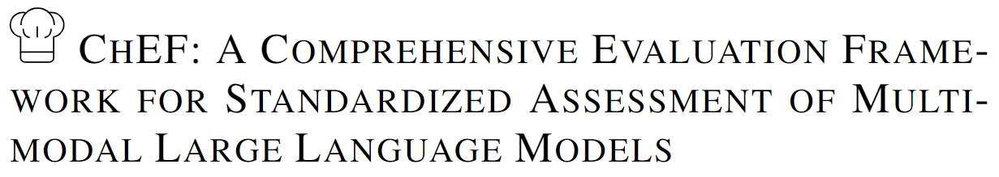

<br/>

<div align="center">
     <br/>
    
</div>
<div>
<div align="center">
    Zhelun Shi<sup>*,1,2</sup>&emsp;
    Zhipin Wang<sup>*,1</sup></a>&emsp;
    Hongxing Fan<sup>*,1</sup></a>&emsp;
    Zhenfei Yin<sup>2</sup></a>&emsp;
    Lu Sheng<sup>&#x2709,1</sup></a>&emsp;
    </br>
    Jing Shao<sup>2</sup></a>&emsp;
    Yu Qiao<sup>2</sup></a>
</div>
<div>
<div align="center">
    <sup>1</sup>Beihang University&emsp;
    <sup>2</sup>Shanghai AI Lab
    </br>
    <sup>*</sup> Equal Contribution&emsp;
    <sup>&#x2709</sup> Corresponding Author
    
</div>


**Official Repository of [CHEF: A COMPREHENSIVE EVALUATION FRAMEWORK FOR STANDARDIZED ASSESSMENT OF MULTIMODAL LARGE LANGUAGE MODEL](https://openlamm.github.io/)**

## Introduction
ChEF is a Comprehensive Evaluation Framework for reliable and indicative assessment of MLLMs, which is highly scalable and can be flexibly modified to adapt to the evaluation of any new model or task.

ChEF decouples the evaluation pipeline into four components: 

- **Scenario**: A set of datasets concerning representative multimodal tasks that are suitable for MLLMs.
- **Instruction**: The module of posing questions and setting instruction examples to the MLLMs. 
- **Inferencer**: Strategies for MLLMs to answer questions.
- **Metric**: Score functions designed to evaluate the performance of MLLMs. 

With a systematic selection of these four componets, ChEF facilitates
versatile evaluations in a standardized framework. Users can easily build new evaluations according to new **Recipes** (i.e. specific choices of the four components). ChEF also sets up several new evaluations to quantify the **desiderata** (desired capabilities) that a competent MLLM model should possess.

## News

📆 [**2023-10-20**] ChEF code is available!

## Scenarios and MLLMs

Supported Scenarios:
<details open>
<summary>(click to collapse)</summary>

- [x] [CIFAR10](https://www.cs.toronto.edu/~kriz/cifar.html)
- [x] [Flickr30k](http://shannon.cs.illinois.edu/DenotationGraph/data/index.html)
- [x] [FSC147](https://github.com/cvlab-stonybrook/LearningToCountEverything)
- [x] [MMBench](https://github.com/open-compass/MMBench)
- [x] [MME](https://github.com/BradyFU/Awesome-Multimodal-Large-Language-Models)
- [x] [Omnibenchmark](https://github.com/ZhangYuanhan-AI/OmniBenchmark)
- [x] [ScienceQA](https://github.com/lupantech/ScienceQA)
- [x] [SEEDBench](https://github.com/AILab-CVC/SEED-Bench)
- [x] [VOC2012](http://host.robots.ox.ac.uk/pascal/VOC/)

</details>


Supported MLLMs:
> More details can be found in [models.md](docs/models.md).

<details open>
<summary>(click to collapse)</summary>

- [x] [InstructBLIP](https://github.com/salesforce/LAVIS)
- [x] [Kosmos2](https://github.com/microsoft/unilm/tree/master/kosmos-2)
- [x] [LAMM](https://github.com/OpenLAMM/LAMM)
- [x] [LLaMA-Adapter-v2](https://github.com/ml-lab/LLaMA-Adapter-2)
- [x] [LLaVA](https://github.com/haotian-liu/LLaVA)
- [x] [MiniGPT-4](https://github.com/Vision-CAIR/MiniGPT-4)
- [x] [mPLUG-Owl](https://github.com/X-PLUG/mPLUG-Owl)
- [x] [Otter](https://github.com/Luodian/Otter)
- [x] [Shikra](https://github.com/shikras/shikra)

</details>

## Get Started 

Please see [get_start.md](docs/get_start.md) for the basic usage of ChEF.

## License 

The project is CC BY NC 4.0 (allowing only non-commercial use) and models trained using the dataset should not be used outside of research purposes. 

## Citation

```bibtex
TODO
```
